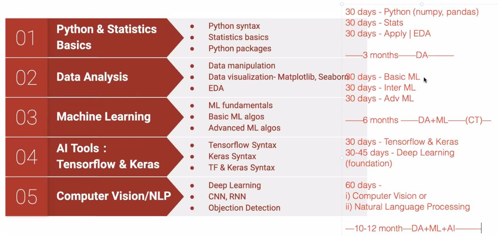

# Algorithms 
{Taken From: https://github.com/keon/algorithms }

Click [Algorithms](https://github.com/rajeshpp/ML-AI/blob/master/DS/Algorithms/README.md) to go there.

Click [Statistics for Data Science](https://www.youtube.com/watch?v=Vfo5le26IhY) to go there.

# ML-AI

1. [ML Google crash course](https://github.com/rajeshpp/ML-AI/blob/master/ML.md)

Maths: 
Analytics need Statistics 
ML need Statistics, Probability, Linear Algebra 
AI need Statistics, Probability, Linear Algebra, Calculus 

Study Plan:  

